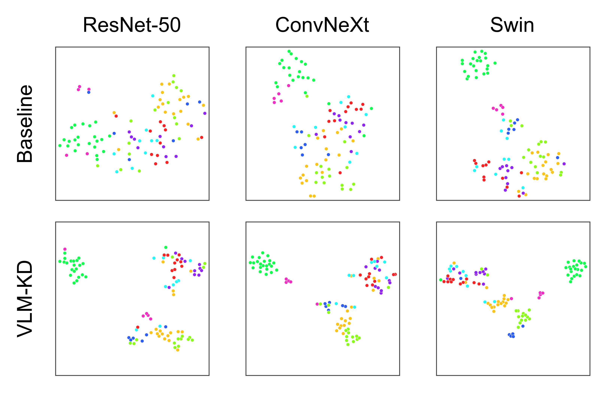
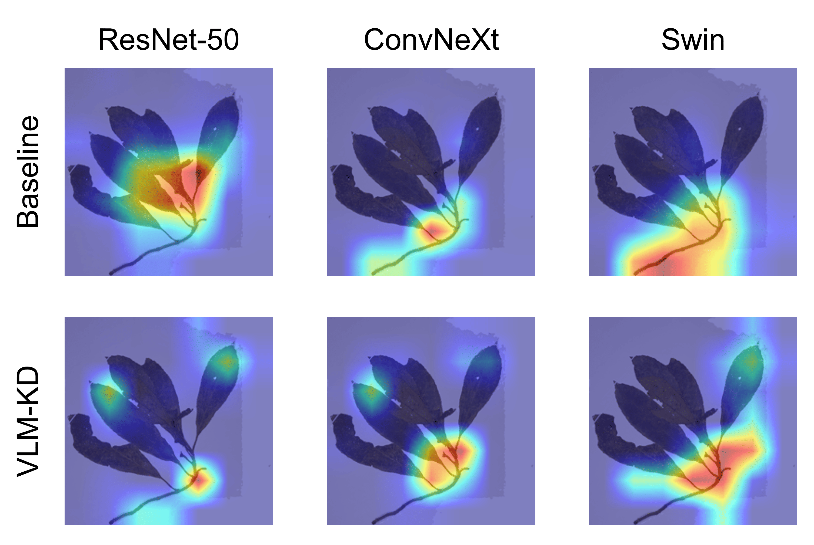

# Vision-Language Model Enhanced Knowledge Distillation for Herbarium Image Classification

This repository contains the training code for our herbarium specimen classification framework. 

The current implementation provides a unified training script for multiple visual backbones and multiple alignment losses. It is designed for controlled experiments, ablation studies, and reproducible comparison across model families.

## Overview

Herbarium specimen classification is difficult because of limited training images, class imbalance, high visual similarity among taxa, and large variation across collections. To address this, we use a multimodal training framework that combines specimen images with morphology-related text descriptions. During training, the model learns both the classification objective and the image-text alignment objective. During inference, the model only needs the image.

Example herbarium sheet:


## Environment

We recommend Python 3.10 or 3.11 and a recent CUDA-enabled PyTorch installation.

Example setup:

```bash
conda create create -f environment.yml
conda activate herbarium_text_alignment
```

## Dataset

The paper uses the Cyrtandra-44 dataset.

The full dataset is provided separately:
[Cyrtandra-44 dataset](https://drive.google.com/drive/folders/1uKQd4RO2eWwxaCXMOM09sCnJzB_eXAZF?usp=sharing)

Additional access information is available in `data/README.md`.

Sample JSONL files and label mappings are included in `examples/sample_jsonl/`.

## Training

```bash
bash scripts/train_resnet44.sh
bash scripts/train_convnext44.sh
bash scripts/train_swin44.sh
bash scripts/train_resnet9.sh
bash scripts/train_convnext9.sh
bash scripts/train_swin9.sh
```

## Checkpoints

Released checkpoints are available on the repository [release page](https://github.com/YuyueGG/Herbirum_Text_Alignment/releases).

## Visualisation

Example visualisation scripts:
- `visualize_model_xai.py`
- `visualize_model_embedding.py`

Example visualisation figures:

<p align="center">
  
</p>

<p align="center">
  <em>t-SNE embedding visualisation.</em>
</p>

<p align="center">
  
</p>

<p align="center">
  <em>Class activation maps.</em>
</p>

### Citation

If you use this code, please cite our paper.
